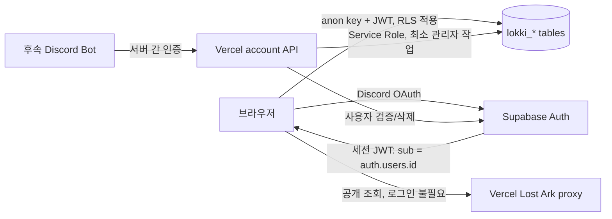

# Supabase 인증·데이터 아키텍처

GitHub #81의 기준 설계다. 후속 인증과 저장 기능은 이 문서 및
`supabase/migrations/20260904150000_create_lokki_account_core.sql`을 계약으로 사용한다.

## 결정 사항

| 항목 | 결정 |
| --- | --- |
| 인증 식별자 | `auth.users.id` UUID를 모든 소유권의 기준으로 사용한다. Discord ID는 소유권 키로 사용하지 않는다. |
| INXX 테이블 재사용 | `public.users`, `public.user_characters`를 재사용하지 않는다. 두 테이블은 INXX 길드 도메인과 역할 체계에 결합되어 있고 `auth.users`와도 직접 연결되지 않는다. |
| 격리 방식 | Supabase Data API와 타입 생성을 단순하게 유지하기 위해 `public` 스키마 안에서 `lokki_` 접두사를 사용한다. 보안 함수만 API에 노출되지 않는 `private` 스키마에 둔다. |
| Discord ID | `lokki_profiles.discord_id`에 nullable unique 값으로 저장한다. 검증된 OAuth identity를 읽을 수 있는 서버만 기록하며 브라우저에는 해당 열의 쓰기 권한을 부여하지 않는다. |
| 삭제 | `auth.users` 삭제 또는 사용자의 `lokki_profiles` 삭제 시 원정대, 캐릭터, 주간 상태를 cascade 삭제한다. |
| 공개 범위 | 이번 스키마의 모든 행은 사용자 전용이다. 공개 Lost Ark API 조회와 계산 결과는 Supabase에 의존하지 않는다. |
| Service Role | 계정 삭제, 검증된 Discord identity 동기화 등 관리자 작업에만 Vercel Function에서 사용한다. 브라우저 번들에는 절대 포함하지 않는다. |

같은 Supabase 인스턴스를 사용하더라도 INXX 객체와 이름이 겹치지 않는다. 기존 INXX의
`public.users.id`는 별도 생성 UUID이고 길드 역할을 포함하므로 로아끼욧 계정의 기준으로
사용하면 계정 수명주기와 RLS를 안전하게 연결할 수 없다. `auth.users`와 OAuth provider 설정은
인스턴스 공용이므로 두 앱 모두 명시적인 `redirectTo`를 전달하고 양쪽 회귀 테스트를 수행한다.

## 인증 및 데이터 흐름



1. Discord OAuth 성공 후 `auth.users.id`가 안정적인 사용자 키가 된다.
2. Auth 사용자 생성 트리거가 최소 `lokki_profiles` 행을 만든다. 공유 Auth에 이미 존재하던 INXX 사용자는 트리거가 다시 실행되지 않으므로 로그인 초기화 단계에서 본인 profile을 idempotent하게 insert해야 한다.
3. 브라우저는 Supabase anon key와 사용자 JWT로 본인 행만 직접 CRUD한다.
4. 로그아웃 또는 Supabase 장애 시 로컬 저장소와 공개 기능은 계속 동작한다. 저장 실패는 후속 저장소 계층에서 별도로 표시한다.
5. Service Role은 RLS를 우회하므로 사용자 JWT를 검증한 Vercel Function 안에서만 사용한다.

## 데이터 계약

TypeScript 계약은 `src/types/lokkiAccount.ts`에 있다.

- `lokki_profiles`: 계정 표시 정보와 서버 관리 Discord ID. PK는 `auth.users.id`와 동일하다.
- `lokki_rosters`: 사용자당 하나인 원정대와 대표 캐릭터 이름.
- `lokki_characters`: 저장된 원정대 캐릭터. 사용자당 캐릭터 이름이 유일하고 대표 캐릭터는 최대 한 명이다.
- `lokki_weekly_states`: 월요일을 기준으로 한 캐릭터별 또는 계정 공통 주간 활동 상태. `character_id = null`은 계정 공통 상태다.

모든 사용자 테이블에 `user_id`를 유지한다. 이 중복은 각 RLS 정책이 다른 사용자 테이블을
조회하지 않고 `(select auth.uid()) = user_id`만 평가하게 하며, 복합 외래 키가 다른 사용자의
원정대나 캐릭터를 연결하는 것도 차단한다.

캐릭터 API 원문, STOVE 토큰, STOVE 결제 원본 로그는 이 스키마에 저장하지 않는다.
스냅샷과 성장 계획은 실제 저장 요구사항이 확정되는 후속 마이그레이션에서 추가한다.

## 접근 경계

### 브라우저 직접 접근

- 로그인 세션 생성, 갱신, 로그아웃
- 본인 profile의 `display_name`, `avatar_url` 변경
- 본인 원정대, 캐릭터, 주간 상태 CRUD
- `VITE_SUPABASE_URL`, `VITE_SUPABASE_ANON_KEY`만 사용

### Vercel Function 전용

- 검증된 Auth identity에서 `discord_id` 동기화
- 관리자 권한이 필요한 계정 조회·삭제
- Discord Bot용 인증 API
- `SUPABASE_URL`, `SUPABASE_SERVICE_ROLE_KEY` 사용

서버 API는 전달받은 `user_id`를 신뢰하지 않고 사용자 JWT 또는 Bot 서버 자격 증명을 먼저
검증해야 한다. Service Role 클라이언트는 요청 간 사용자 상태를 저장하지 않는다.

## RLS 및 권한

네 사용자 테이블 모두 RLS가 활성화되어 있고 authenticated 역할은 본인 `user_id` 행만
CRUD할 수 있다. anon 역할에는 테이블 권한이 없다. `user_id`, 생성 시각과 같은 소유권/감사
열은 브라우저 update 대상이 아니며 `discord_id`는 insert/update 모두 서버 전용이다.

검증 파일은 `supabase/tests/lokki_account_rls.test.sql`이다. 두 임시 Auth 사용자를 만든 뒤
익명 접근 거부, 소유자 CRUD, 타 사용자 격리, Discord ID 열 권한 및 cascade 삭제를 검사하고
전체 트랜잭션을 rollback한다.

## 환경과 OAuth Redirect URL

| 환경 | Site URL / Redirect allow list |
| --- | --- |
| Local | `http://localhost:3001`, `http://localhost:3001/auth/callback` |
| Vercel Preview | 실제 팀/프로젝트 slug로 제한한 `https://*-<team>.vercel.app/auth/callback` 패턴. 광범위한 `**` 패턴은 사용하지 않는다. |
| Production | `https://lokki.vercel.app`, `https://lokki.vercel.app/auth/callback` |

Supabase Dashboard에서 Discord provider의 client ID/secret을 설정하고, Discord Developer
Portal에는 Supabase가 표시하는 provider callback URL
`https://<project-ref>.supabase.co/auth/v1/callback`을 등록한다. 앱의 `/auth/callback`은
Supabase Redirect allow list에 등록하는 로그인 완료 복귀 주소다.

환경변수 이름은 `.env.example`을 기준으로 한다.

- 브라우저 공개 가능: `VITE_SUPABASE_URL`, `VITE_SUPABASE_ANON_KEY`
- 서버 전용: `SUPABASE_URL`, `SUPABASE_SERVICE_ROLE_KEY`

Vercel에서는 Preview와 Production 값을 각각 설정한다. 로컬 실제 값은 `.env.local`에 두고
커밋하지 않는다. Service Role 값을 `VITE_` 접두사 변수에 넣거나 클라이언트 코드에서 읽으면
안 된다.

## 적용과 검증

Supabase CLI를 설치하고 로컬 프로젝트를 시작한 환경에서 실행한다.

```bash
yarn supabase start
yarn supabase db reset
yarn supabase test db
```

공유 원격 프로젝트에는 먼저 dry run 결과를 검토한 뒤 적용한다.

```bash
yarn supabase link --project-ref <project-ref>
yarn supabase db push --dry-run
yarn supabase db push
```

적용 후 확인 사항:

1. `lokki_` 테이블 4개와 인덱스가 생성됐는지 확인한다.
2. `supabase test db`의 RLS 테스트가 모두 통과하는지 확인한다.
3. INXX의 `users`, `user_characters` 및 기존 정책에 변경이 없는지 확인한다.
4. Local, Preview, Production에서 Discord OAuth가 각각 허용된 callback으로만 복귀하는지 확인한다.
5. 로그아웃 상태에서 기존 캐릭터 조회와 계산 기능이 정상 동작하는지 확인한다.

## 롤백

아직 사용자 데이터가 없는 최초 적용 실패 시
`supabase/rollback/20260904150000_create_lokki_account_core.sql`을 SQL Editor 또는 psql로
실행할 수 있다. 이 파일은 모든 로아끼욧 회원 데이터를 삭제하므로 운영 데이터가 생긴 뒤에는
직접 실행하지 않는다.

운영 적용 후에는 데이터를 보존하는 forward-fix 마이그레이션을 우선한다. 파괴적 롤백이
필요하면 먼저 백업하고 서비스 쓰기를 중지한 다음 영향 범위를 확인한다. 확장과 `private`
스키마는 INXX가 사용할 수 있으므로 롤백에서 삭제하지 않는다.
